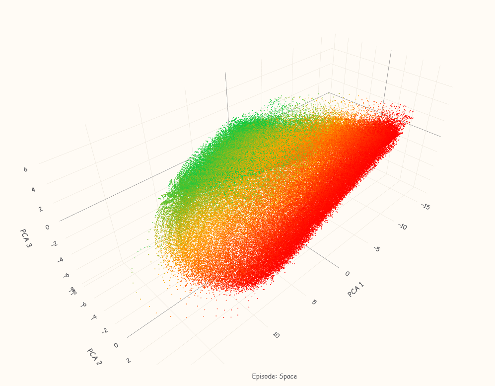
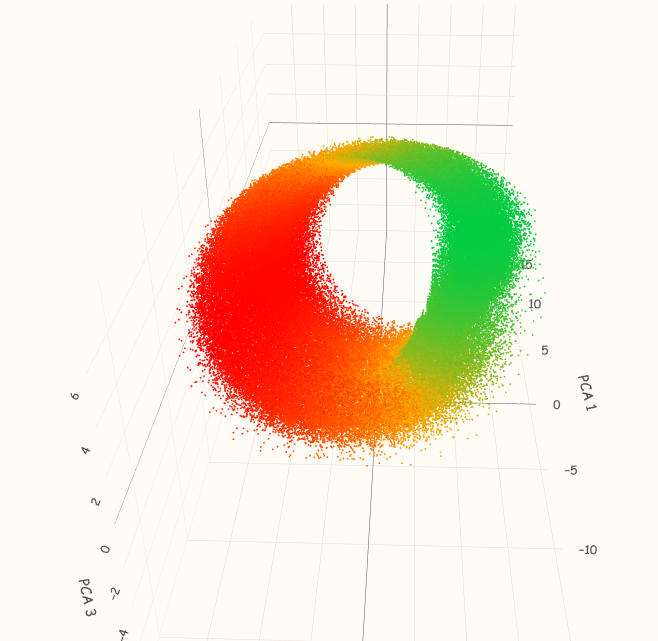
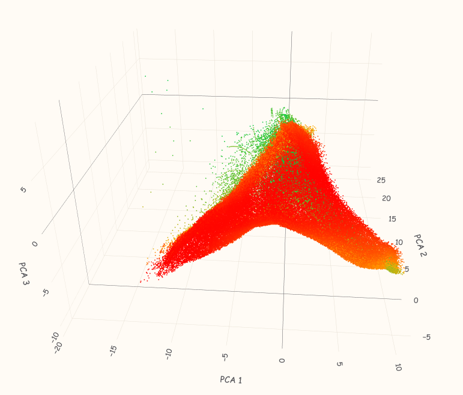
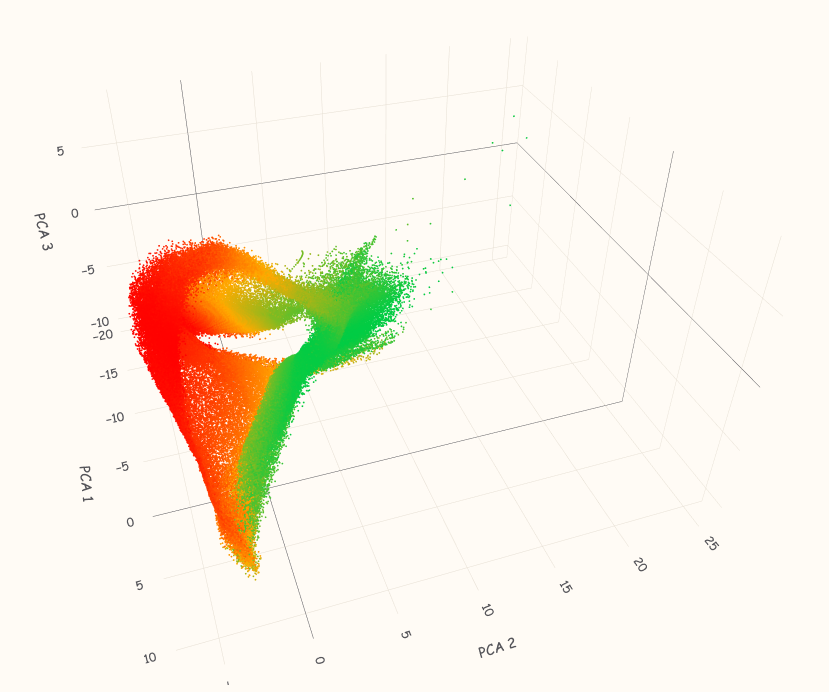
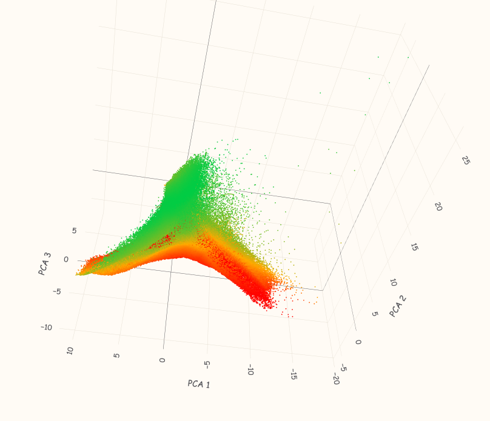
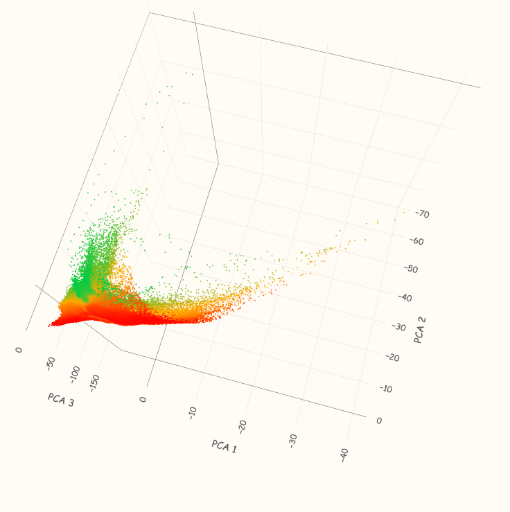
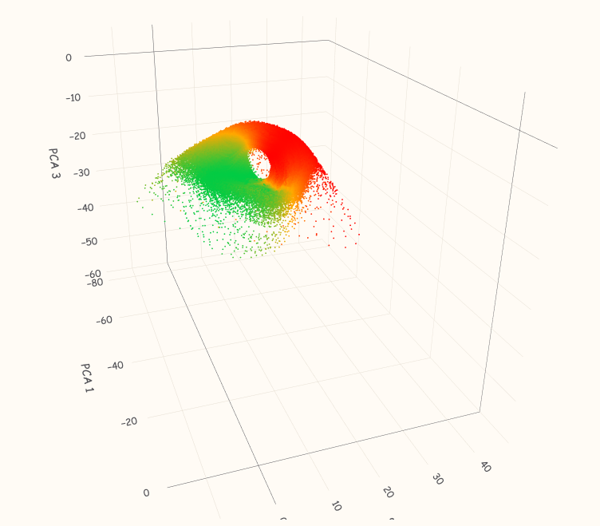
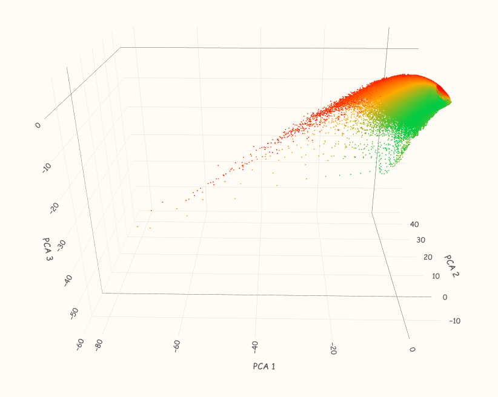
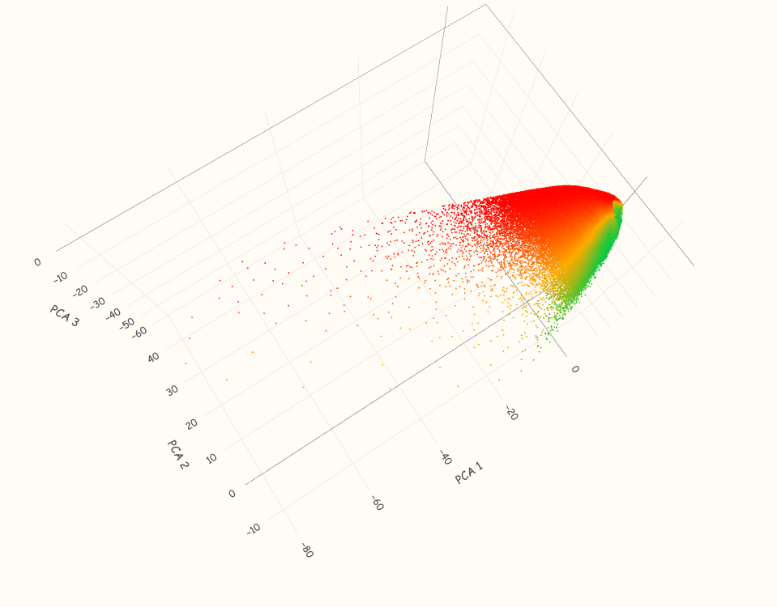

# Navigating the Policy Manifold: Representation Geometry of a CartPole DQN

> *Can we understand what a reinforcement learning agent "thinks" by measuring the shape of its hidden activations?*

A trained CartPole DQN is analysed through the lens of Riemannian differential geometry. The hidden representation defines an immersion of the state space into a 64-dimensional activation space, with a local metric induced via the pullback metric G = JᵀJ, where J is the Jacobian of the hidden representation with respect to the input state. Steering vectors are then used to nudge activations toward goal states at inference time, and the geometric consequences are measured.

---

## Overview

Most interpretability work asks *which* neurons matter. This project asks a different question: **what is the intrinsic geometry of the trajectory the agent traces through representation space, and does that geometry tell us something about behaviour quality?**

The pipeline:

1. Train a CartPole agent with Double DQN (browser-based, no external dependencies)
2. Collect hidden-layer activations across 50 training episodes
3. Compute **linear steering vectors** pointing from a failing state toward a goal state in activation space
4. Apply steering at inference time and compare behaviour
5. Analyse trajectories using the **First Fundamental Form** and **Frenet–Serret frame** (arc length, curvature κ, torsion τ) across four activation function interpretations of the same frozen weights

---

## Visualisations

Each activation function induces a dramatically different manifold geometry from the same frozen weights. All four manifolds below are the same network — only the activation function applied during analysis changes.

### Identity

| Side view | Top-down view | End-on (ring structure) |
|:---:|:---:|:---:|
|  |  |  |

The identity activation produces a large flat **slab** — high-reward states (green) concentrated in the centre, low-reward states (red) ringing the boundary. The end-on view reveals a hollow ring structure: the agent rarely visits the interior of representation space.

### Leaky ReLU

| Perspective 1 | Perspective 2 | Perspective 3 |
|:---:|:---:|:---:|
|  |  |  |

LReLU produces a **wedge or boomerang** shape — a sharp high-reward peak at the tip with a long low-reward tail. The nonlinearity introduces clear directional structure absent in the identity case.

### Tanh



Tanh compresses the manifold into a tight **L-shaped hook** — the majority of states cluster near the origin with a sparse high-reward arm extending outward. The saturation of tanh aggressively collapses the representation volume.

### Sigmoid

| Front view | Side view | Angled |
|:---:|:---:|:---:|
|  |  |  |

Sigmoid produces the most visually striking result: a smooth **teardrop or bullet** shape — compact, dense, with high-reward states concentrated at a sharp green tip.

---

## Key Findings

### 1. Steering vectors reliably improve performance

A single linear vector in 64-dimensional hidden space, computed as `h(goal) − h(initial)`, shifts average reward from **1.96 → ~2.70** across three of four steering variants — a ~38% improvement with zero retraining.

| Episode type | Avg Reward | Total Reward |
|---|---|---|
| Normal (baseline) | 1.962 | 1964 |
| Steered — Identity | **2.689** | 2692 |
| Steered — Tanh | **2.698** | 2701 |
| Steered — Sigmoid | **2.706** | 2709 |
| Steered — LReLU | 1.865 | 1867 |

LReLU steering underperforms baseline — consistent with LReLU's wedge-shaped manifold having a less linearly separable goal direction than the other activations.

### 2. Steered episodes are geometrically more complex

Higher reward isn't "staying still" — it comes with measurably longer and more curved trajectories in activation space. Under the identity activation:

| Episode | Arc (FFF) | κ | τ |
|---|---|---|---|
| Normal | 5988 | 1109 | 1146 |
| Steered (Identity) | **10737** | **1640** | **1601** |
| Steered (Tanh) | **10699** | **1686** | **1655** |

The steered agent traces nearly **twice the arc length** per episode with ~50% more curvature — suggesting the policy traverses a larger and more geometrically complex region of representation space during successful control.

### 3. Activation function choice dramatically reshapes manifold geometry

The same frozen weights, re-analysed through four different activation functions, produce manifolds with entirely different scale and shape:

| Activation | Mean Arc | Mean κ | Mean τ | κ/arc |
|---|---|---|---|---|
| Identity | 5548 ± 826 | 1107 ± 160 | 1131 ± 172 | ~0.20 |
| Leaky ReLU | 659 ± 101 | 812 ± 111 | 824 ± 117 | ~1.23 |
| Tanh | 472 ± 72 | 1285 ± 183 | 1347 ± 198 | ~2.72 |
| Sigmoid | 57 ± 8 | 1145 ± 166 | 1157 ± 172 | ~20.2 |

Arc length shrinks by **100×** from identity to sigmoid, but curvature stays roughly constant — meaning the sigmoid manifold packs the same geometric complexity into a far smaller region (high κ/arc). The activation function does not just rescale the manifold; it fundamentally changes its shape, as visible in the screenshots above.

### 4. Episode 31 is a universal geometric signature of failure

Ep 31 is a near-immediate failure — the agent drops the pole almost instantly. Its geometry is unmistakable across every activation function:

| Activation | Arc | κ | τ |
|---|---|---|---|
| Identity | 94.1 | 71.4 | 17.8 |
| LReLU | 13.4 | 72.7 | 32.9 |
| Tanh | 5.6 | 71.5 | 30.0 |
| Sigmoid | 0.6 | 57.4 | 28.4 |

Near-zero arc, near-zero torsion — the agent barely moves in representation space before the episode ends. This acts as a **geometric signature of failure**, robust across all four activation interpretations. The consistency suggests this is a property of the trajectory itself rather than an artefact of the activation choice.

---

## Method

### Network

```
Input (7) → Hidden (32, LReLU) → Hidden (64, LReLU) → Output (3, Linear)
```

Input features use wrapped position encoding:

```
cos(x/W),  sin(x/W),  ẋ/20,  sin(θ),  cos(θ),  θ̇/5,  θ̈/10
```

Trained with Double DQN + Adam, ε-greedy exploration decaying 0.999 → 0.01, target network sync every 100 steps.

### Steering vectors

```python
v = h(goal_state) − h(initial_state)
v = v / ||v||

# At inference:
hidden += alpha * v   # injected before the final linear layer
```

Four steering vectors are provided, each computed by re-passing states through the frozen weights with a different activation function (identity, LReLU, tanh, sigmoid).

### Riemannian geometry

Trajectories in 64D hidden space are treated as curves on a Riemannian manifold. The metric at each point is the **First Fundamental Form**:

```
G = Jᵀ J       where J = ∂h/∂x  (Jacobian via autograd)
```

From this, we compute:

- **Manifold speed**: `ds/dt = √(dxᵀ G dx)`
- **Tangent vector**: `T = J·dx / speed`
- **Curvature**: `κ = |dT/ds|`
- **Torsion**: `τ` via Gram–Schmidt orthogonalisation of the Frenet–Serret frame

All Jacobians were computed with `torch.autograd.functional.jacobian`.

---

## Repository Structure

| File | Description |
|---|---|
| `NeuralNetwork.js` | Vanilla JS neural net — feedforward, Adam backprop, `FeedForwardSteered()` |
| `CartpoleManifold.html` | DQN training environment — trains agent in-browser, exports weights + experience |
| `CartpoleStateCollecter.html` | Runs trained policy, collects state/reward data |
| `CartpoleSteering.html` | Inference with hidden-layer activation steering |
| `GetSteeringVector.py` | Computes linear steering vectors in each activation space |
| `GeometryAnalysis.py` | Per-episode Riemannian geometry (arc length, κ, τ) via autograd Jacobians |
| `SteeringAnalysis.py` | Full 5×4 geometry comparison table (5 episode types × 4 activations) |
| `Visualisation.py` | Generates interactive 3D PCA visualiser (self-contained HTML, no server needed) |
| `NeuralNetwork_Fixed_Weights.json` | Trained network weights |
| `ExperienceData_0.json` | Full experience buffer with hidden activations |
| `v_linear_[idn\|relu\|tanh\|sigmoid].json` | Precomputed steering vectors |

---

## Requirements

**Python** (geometry analysis + visualiser):
```
numpy  torch  matplotlib  scikit-learn  scipy
```

**Browser** (training + steering demo): any modern browser, no build step.

---

## How to Run

```bash
# 1. Open CartpoleManifold.html in a browser to train
#    (exports ExperienceData_0.json and weights when done)

# 2. Collect states with the trained policy
#    Open CartpoleStateCollecter.html

# 3. Compute steering vectors
python GetSteeringVector.py      # edit selected_act at top for each variant

# 4. Analyse geometry
python GeometryAnalysis.py        # per-episode stats, single activation
python SteeringAnalysis.py       # full 5×4 comparison table

# 5. Launch interactive visualiser
python Visualisation.py              # outputs cartpole_manifold_interactive.html

# 6. Try steering at inference
#    Open CartpoleSteering.html  (edit fetch URL for different steering vectors)
```

---

## Limitations & Future Work

- The steering vector is linear; nonlinear directions (e.g., along geodesics) may be more effective
- Geometry is computed post-hoc on frozen weights — online geometric analysis during training is unexplored
- Only one trained network is analysed; results across seeds would strengthen the geometric conclusions
- The κ/arc ratio as a "complexity density" metric is informal — formalising this could be interesting
- Construct steering directions using manifold geodesics rather than linear differences in activation space
